## Data flow



## Description

[Nest](https://github.com/nestjs/nest) framework TypeScript starter repository.

## Installation

```bash
$ yarn install
```

## Running the app
use node ^18

```bash
# start redis
$ docker-compose up

# development
$ npm run start
$ npm run start solicitation-queue-ms
$ npm run start support-teams-ms

# watch mode
$ npm run start:dev
$ npm run start:dev solicitation-queue-ms
$ npm run start:dev support-teams-ms

# production mode
$ npm run start:prod
$ npm run start:prod solicitation-queue-ms
$ npm run start:prod support-teams-ms
```

## Documentation

Swagger doc on route /api of relationship-bff service
```bash
$ http://localhost:3000/api
```

## Stay in touch

- Author - [Saulo Joseph](https://www.linkedin.com/in/saulodesousajoseph1994/)